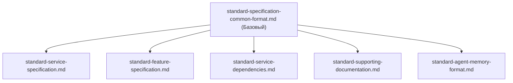

# 📋 Стандарты Проекта

[⬅️ К оглавлению][backlink-parent]

Этот раздел содержит стандарты и руководства по документированию проекта bepiscorp-hawk.

---

## 📚 Список стандартов

### Базовые стандарты

- **[Стандарт общего формата спецификаций][standard-common]**
  Универсальный формат для всех Markdown-документов спецификаций. Определяет структуру, метаданные, навигацию и правила оформления.

### Специализированные стандарты

- **[Стандарт специфицирования сервисов][standard-services]**
  Структура и содержание документации для сервисов в `knowledge/services/`.

- **[Стандарт специфицирования фичей][standard-features]**
  Hub-and-Node паттерн для документирования функциональности. Описывает структуру Hub (feature-level) и Node (service-level) документов.

- **[Стандарт управления зависимостями между сервисами][standard-deps]**
  Документирование, управление и валидация зависимостей между сервисами. Включает dependency mapping, deployment order, blast radius analysis.

- **[Стандарт вспомогательной документации][standard-supporting]**
  Шаблоны для Technology Reference, Operational Runbook и Troubleshooting Guide в `docs/` поддиректории сервисов.

- **[Стандарт формата memory-файлов агента][standard-memory]**
  Формат и структура для memory-файлов в `knowledge/memory/agent-memories/`. Определяет типы записей, обязательные поля, шаблоны и интеграцию с документацией.

---

## 🔄 Связи между стандартами

---

## 📖 Руководство по использованию

### Для создания новой спецификации сервиса

1. Прочитайте [Стандарт общего формата][standard-common]
2. Используйте шаблон из [Стандарта спецификации сервисов][standard-services]
3. Заполните раздел зависимостей согласно [Стандарту управления зависимостями][standard-deps]

### Для создания новой фичи

1. Прочитайте [Стандарт общего формата][standard-common]
2. Создайте Hub документ согласно [Стандарту специфирования фичей][standard-features]
3. Создайте Node документы в каждом затронутом сервисе
4. Если фича затрагивает 2+ сервиса, заполните разделы Deployment Sequence и Blast Radius

---

[standard-common]: ./standard-specification-common-format.md
[standard-services]: ./standard-service-specification.md
[standard-features]: ./standard-feature-specification.md
[standard-deps]: ./standard-service-dependencies.md
[standard-supporting]: ./standard-supporting-documentation.md
[standard-memory]: ./standard-agent-memory-format.md
[backlink-parent]: ../INDEX.md
