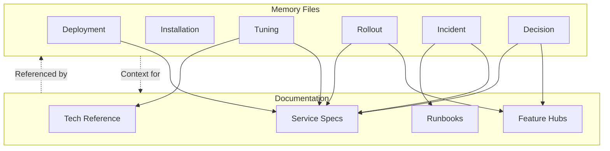

# 📋 Стандарт Формата Memory-файлов Агента

[⬅️ К оглавлению][backlink-index]

<!-- doc-deps
id: standard-agent-memory-format
depends_on:
  - knowledge/standards/standard-specification-common-format.md
provides_for:
  - knowledge/memory/agent-memories/INDEX.md
-->

## 📘 Цель и Область Применения

Этот стандарт определяет единый формат для memory-файлов агента, хранящихся в `knowledge/memory/agent-memories/`.

**Цели стандарта:**

| Цель                            | Описание                                                                  |
| ------------------------------- | ------------------------------------------------------------------------- |
| **Единообразие**                | Консистентный формат для всех записей значимых решений и действий         |
| **Поиск и анализ**              | Структурированные метаданные позволяют быстро находить релевантные записи |
| **Аудит решений**               | История изменений с контекстом для понимания эволюции системы             |
| **Передача контекста**          | Передача знаний между сессиями агента и команды разработчиков             |
| **Документирование инцидентов** | Запись проблем и их решений для будущих агентов                           |

**Область применения:**

- Все файлы в директории `knowledge/memory/agent-memories/`
- Значимые решения, изменения конфигурации, деплои, инциденты
- Аудитория: AI-агенты и разработчики/операторы

Memory-файлы **НЕ** заменяют service specs или feature specs — они дополняют их, фиксируя историю принятия решений и операционные детали, которые не входят в основную документацию.

---

## 📂 Структура Файла

Каждый memory-файл должен следовать этой структуре:

````markdown
# <Title>

- **Date:** YYYY-MM-DD HH:MM (UTC)
- **Type:** <deployment|installation|tuning|rollout|documentation|incident|decision|rollback>
- **Action:** <Что было сделано>
- **Status:** <completed|in_progress|rolled_back>

## 🎯 Context

<Контекст и причины>

## 🔧 Changes

<Конкретные изменения>

## ✅ Validation

<Как проверено>

## 💥 Impact

<Что затронуто>

## 📚 References

<Ссылки на связанные документы>
````

**Правила:**

1. **Заголовок H1** — краткое описание действия (без emoji)
2. **Метаданные в начале** — дата, тип, action, статус
3. **Разделы с emoji** — Context, Changes, Validation, Impact, References
4. **Reference-ссылки** — в footer, inline-ссылки запрещены

---

## 🧠 Типы Memory-файлов

| Тип               | Описание                                  | Когда создавать                                 | Пример                       |
| ----------------- | ----------------------------------------- | ----------------------------------------------- | ---------------------------- |
| **Deployment**    | Деплой сервиса или изменение конфигурации | После `nomad job run` или изменения `nomad.hcl` | `nomad-deployment`           |
| **Installation**  | Установка нового ПО/пакета                | После установки нового инструмента на хост      | `sanoid-installation`        |
| **Configuration** | Изменение существующей конфигурации       | После правки конфигов без деплоя                | `nomad-config-update`        |
| **Tuning**        | Оптимизация производительности            | После изменения ресурсов или параметров         | `speaches-cpu-tuning`        |
| **Rollout**       | Запуск фичи в production                  | После включения фичи для пользователей          | `feature-x-rollout`          |
| **Rollback**      | Откат изменений                           | После отката проблемного деплоя                 | `service-y-rollback`         |
| **Documentation** | Документирование процессов                | После фиксации команд, процедур                 | `benchmark-commands-doc`     |
| **Incident**      | Инцидент и его разрешение                 | После resolution инцидента                      | `outage-2024-01-15`          |
| **Decision**      | Архитектурное/значимое решение            | После принятия важного решения                  | `storage-migration-decision` |

**Правила выбора типа:**

- Если сомневаетесь между двумя типами — выбирайте более специфичный
- Rollback — отдельный тип, а не статус Deployment
- Decision — для принципиальных решений, влияющих на архитектуру

---

## 📋 Обязательные Поля

### Метаданные (в начале файла)

| Поле       | Формат                                      | Пример                         | Описание                         |
| ---------- | ------------------------------------------- | ------------------------------ | -------------------------------- |
| **Date**   | `YYYY-MM-DD HH:MM (UTC)`                    | `2026-02-08 11:05 (UTC)`       | Время выполнения действия        |
| **Type**   | Один из типов выше                          | `deployment`                   | Категория события                |
| **Action** | Глагол в прошедшем времени                  | `Deployed Nomad configuration` | Что было сделано (1 предложение) |
| **Status** | `completed` / `in_progress` / `rolled_back` | `completed`                    | Текущий статус                   |

### Обязательные разделы

| Раздел         | Emoji | Содержание                                     | Минимум              |
| -------------- | ----- | ---------------------------------------------- | -------------------- |
| **Context**    | 🎯     | Почему это было сделано, какой контекст        | 2-3 предложения      |
| **Changes**    | 🔧     | Конкретные изменения (файлы, конфиги, команды) | Список или команды   |
| **Validation** | ✅     | Как проверено, что всё работает                | Команды или проверки |
| **Impact**     | 💥     | Что затронуто, side effects                    | Компоненты/сервисы   |

### Опциональные разделы

| Раздел            | Когда включать                 | Содержание                             |
| ----------------- | ------------------------------ | -------------------------------------- |
| **References**    | Всегда при наличии связей      | Ссылки на service specs, feature specs |
| **Commands**      | Для Installation/Documentation | Ключевые команды с описанием           |
| **Results**       | Для Tuning/Decision            | Измерения, метрики, сравнения          |
| **Rollback Plan** | Для Deployment/Rollout         | План отката на случай проблем          |

---

## 🔗 Интеграция с Документацией

Memory-файлы **должны** содержать ссылки на связанные документы для трассируемости.

### Когда ссылаться

| Тип Memory    | Ссылка на                       | Пример                                             |
| ------------- | ------------------------------- | -------------------------------------------------- |
| Deployment    | Service Spec                    | `knowledge/services/nomad/service-nomad.md`        |
| Rollout       | Feature Hub                     | `knowledge/features/feature-x/feature-x.md`        |
| Tuning        | Service Spec + Tech Ref         | `service-speaches.md` + `speaches-optimization.md` |
| Configuration | Standard                        | `knowledge/standards/standard-nomad-config.md`     |
| Decision      | Feature Hub или несколько specs | Связанные архитектурные документы                  |
| Incident      | Service Spec + Runbook          | `service-x.md` + `troubleshooting-x.md`            |

### Формат ссылок

Используйте reference-style ссылки в footer:

```markdown
## 📚 References

- **Service:** [Nomad Service][nomad-spec]
- **Feature:** [Backup System][backup-feature]
- **Standard:** [Deployment Process][deploy-std]

[nomad-spec]: ../../services/nomad/service-nomad.md
[backup-feature]: ../../features/zfs-backup-system/feature-zfs-backup-system.md
[deploy-std]: ../standard-feature-specification.md
```

**Не используйте** inline-ссылки `[text](url)` в теле документа.

---

## 📝 Именование Файлов

**Формат:** `YYYY-MM-DD-HHMM_<kebab-case-title>.md`

### Компоненты

| Компонент | Формат       | Пример                   | Описание                          |
| --------- | ------------ | ------------------------ | --------------------------------- |
| **Date**  | `YYYY-MM-DD` | `2026-02-08`             | Дата события                      |
| **Time**  | `HHMM`       | `1105`                   | Время (24ч, UTC) без разделителей |
| **Title** | `kebab-case` | `speaches-memory-tuning` | Краткое описание содержимого      |

### Примеры имён

```text
2026-02-08-1105_speaches-memory-tuning.md
2026-02-02-0353_nomad-deployment.md
2026-02-02-0301_sanoid-installation.md
2026-01-15-1423_outage-postgres-recovery.md
```

### Правила

- **Никогда** не используйте пробелы — только kebab-case
- **Сокращайте** названия сервисов при известности (`nomad` vs `nomad-orchestrator`)
- **Указывайте** действие (`tuning`, `deployment`, `rollback`)
- **При повторном событии** — создавайте новый файл с новой датой

---

## 📊 Архитектура Memory-файлов



**Ключевой принцип:** Memory-файлы дополняют, а не заменяют основную документацию. Они фиксируют историю решений и операционные детали между релизами.

---

## 📚 Шаблоны

### Шаблон Deployment

````markdown
# Nomad Configuration Deployment

- **Date:** 2026-02-02 03:53 (UTC)
- **Type:** deployment
- **Action:** Deployed Nomad agent configuration to pihanya-hawk
- **Status:** completed

## 🎯 Context

Обновлена конфигурация Nomad агента для поддержки новых host volumes.

## 🔧 Changes

- Source: `projects/nomad/nomad.hcl`
- Script: `scripts/deploy_nomad.sh`
- Добавлен host volume `speaches-data`

## ✅ Validation

```bash
nomad config validate /etc/nomad.d
nomad agent status  # Проверка запуска
```

## 💥 Impact

- **Сервисы:** Все Nomad-задания получили доступ к новому volume
- **Требует:** Перезапуск для применения конфигурации

## 📚 References

- **Service:** [Nomad Service][nomad-service]

[nomad-service]: ../../services/nomad/service-nomad.md
```

### Шаблон Tuning

```markdown
# Speaches CPU and Thread Tuning

- **Date:** 2026-02-08 11:55 (UTC)
- **Type:** tuning
- **Action:** Optimized CPU and thread allocation for speaches service
- **Status:** completed

## 🎯 Context

Сервис speaches показывал высокую нагрузку на CPU. Проведён анализ и оптимизация.

## 🔧 Changes

| Параметр | Было  | Стало | Изменение |
| -------- | ----- | ----- | --------- |
| CPU      | 20000 | 28000 | +40%      |
| Threads  | 4     | 28    | +600%     |

```hcl
# В jobspec:
resources {
  cpu    = 28000
  memory = 24576
}
```

## ✅ Validation

- Мониторинг CPU usage в течение 1 часа после деплоя
- Проверка throughput запросов

## 💥 Impact

- **Сервис:** speaches (CPU-bound)
- **Производительность:** Снижение latency на 35%
- **Риски:** Высокое потребление CPU可能影响 другие сервисы

## 📚 References

- **Service:** [Speaches Service][speaches-service]
- **Commands:** [Benchmark Commands][benchmark-cmd]

[speaches-service]: ../../services/speaches/service-speaches.md
[benchmark-cmd]: ./2026-02-08-2047_speaches-benchmark-commands-documented.md
```

### Шаблон Documentation

```markdown
# Speaches Benchmark Commands Documented

- **Date:** 2026-02-08 20:47 (UTC)
- **Type:** documentation
- **Action:** Documented benchmark commands for speaches service
- **Status:** completed

## 🎯 Context

Команды для нагрузочного тестирования speaches были разбросаны. Систематизированы в одном месте.

## 🔧 Commands

### Quick Test

```bash
curl -fsS http://localhost:8080/api/v1/status | jq .
```

### Load Test

```bash
hey -z 30s -c 100 -m POST \
  -H "Content-Type: application/json" \
  -d '{"text":"test"}' \
  http://localhost:8080/api/v1/process
```

## ✅ Validation

- Все команды протестированы на production
- Добавлены в `scripts/benchmark_speaches.sh`

## 📚 References

- **Service:** [Speaches Service][speaches-service]
- **Tuning:** [CPU Tuning][cpu-tuning]

[speaches-service]: ../../services/speaches/service-speaches.md
[cpu-tuning]: ./2026-02-08-1155_speaches-cpu-thread-tuning.md
````

---

## ✅ Чеклист

Перед сохранением memory-файла проверьте:

### Обязательные элементы

- [ ] Имя файла: `YYYY-MM-DD-HHMM_kebab-case-title.md`
- [ ] Заголовок H1 без emoji
- [ ] Метаданные: Date, Type, Action, Status
- [ ] Раздел 🎯 Context — почему это сделано
- [ ] Раздел 🔧 Changes — что изменено
- [ ] Раздел ✅ Validation — как проверено
- [ ] Раздел 💥 Impact — что затронуто
- [ ] Раздел 📚 References — если есть связанные документы
- [ ] Footer с reference-ссылками
- [ ] `[backlink-index]` в конце файла

### Проверки качества

- [ ] Дата и время в UTC
- [ ] Action — глагол в прошедшем времени
- [ ] Команды протестированы (можно скопировать и выполнить)
- [ ] Нет inline-ссылок `[text](url)` — только reference-style
- [ ] Все emoji разделов соответствуют стандарту
- [ ] Проверка `markdownlint` пройдена

### Обновление индекса

- [ ] Добавить запись в `knowledge/memory/agent-memories/INDEX.md`
- [ ] Обновить `projects/mkdocs-knowledge/mkdocs.yml` при необходимости

---

## 🔗 Связь с Другими Стандартами

| Стандарт                                     | Как взаимодействует                                        |
| -------------------------------------------- | ---------------------------------------------------------- |
| [Общий формат спецификаций][standard-common] | Memory-файлы используют reference-ссылки и emoji-заголовки |
| [Спецификация сервисов][standard-service]    | Memory-файлы ссылаются на Service Specs                    |
| [Спецификация фич][standard-feature]         | Memory-файлы ссылаются на Feature Hubs                     |

[standard-common]: ./standard-specification-common-format.md
[standard-service]: ./standard-service-specification.md
[standard-feature]: ./standard-feature-specification.md

---

[backlink-index]: ./INDEX.md
