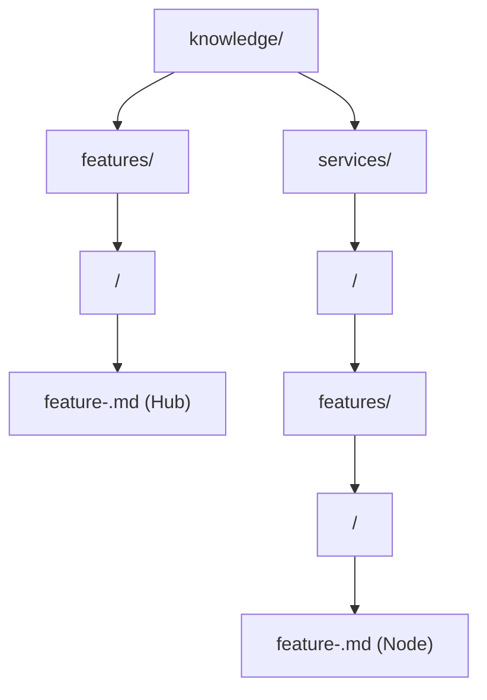
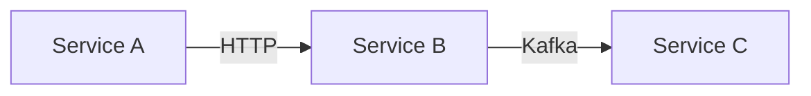

# 📋 Стандарт специфицирования фичей

[⬅️ К оглавлению][backlink-index]

<!-- doc-deps
id: standard-feature-specification
depends_on:
  - knowledge/standards/standard-specification-common-format.md
provides_for:
  - knowledge/features/*/feature-*.md
  - knowledge/services/*/features/*/feature-*.md
-->

Этот стандарт описывает подход по созданию спецификации новой функциональности (Feature Cards) в проекте. Документация разбивается на два уровня: верхнеуровневое описание фичи (Hub) и детальные спецификации реализации в сервисах (Nodes).

**Связь с другими стандартами:**

- **Общий формат:** Feature спецификации следуют [Стандарту общего формата][standard-common-format] для структуры документа, метаданных и навигации.
- **Зависимости:** Для документирования Deployment Sequence и Blast Radius см. [Стандарт управления зависимостями][standard-dependencies].
- **Сервисы:** Детальная документация сервисов, реализующих фичи, описана в [Стандарте спецификации сервисов][standard-services].

---

## 📌 Scope Boundaries (Области ответственности)

### Feature Hub — ДОЛЖЕН содержать

- [ ] **Бизнес-задача:** Зачем нужна фича, какую проблему решает (1-2 абзаца)
- [ ] **Ключевые требования:** Что должна уметь фича (bullet list)
- [ ] **Архитектурные решения:** Таблица Decision / Rationale / Trade-off
- [ ] **Data Flow:** Диаграмма взаимодействия компонентов в Mermaid
- [ ] **Секции по сервисам:** Краткое описание роли + ссылка на Node document
- [ ] **Deployment Sequence:** Порядок деплоя (если 2+ сервиса)
- [ ] **Blast Radius:** Анализ влияния изменений (если 2+ сервиса)

### Feature Hub — НЕ ДОЛЖЕН содержать

- [ ] **Configuration values:** Порты, memory sizes, конкретные параметры
- [ ] **Deployment commands:** `nomad job run`, `docker run` и т.п.
- [ ] **Code snippets:** curl examples, test scripts
- [ ] **Technology internals:** Детали работы underlying технологий (фреймворки, драйверы, оптимизации)
- [ ] **Troubleshooting:** Процедуры решения проблем

> **Правило:** Feature Hub отвечает на вопросы **"Зачем?"** и **"Что?"**, но не **"Как именно?"**.
> Для деталей реализации — ссылка на Feature Node или Service Spec.

### Feature Node — ДОЛЖЕН содержать

- [ ] **Роль сервиса:** Зона ответственности в рамках фичи
- [ ] **Функциональность:** Логика работы, алгоритмы, data transformations
- [ ] **API контракты:** Endpoints, форматы запросов/ответов
- [ ] **Обработка ошибок:** Коды ошибок, retry logic, fallbacks
- [ ] **Test cases:** Описание ключевых сценариев для тестирования

### Feature Node — НЕ ДОЛЖЕН содержать

- [ ] **Technology internals:** Детали работы underlying технологии
- [ ] **Infrastructure config:** Host volumes, GPU allocation, driver versions
- [ ] **Operational procedures:** Backup, restore, troubleshooting

> **Правило:** Feature Node отвечает на вопрос **"Как сервис реализует свою часть фичи?"**.
> Для technology internals — ссылка на `docs/TECHNOLOGY.md`.

---

## 📂 Структура директорий

Документация хранится в директории `knowledge/` и повторяет структуру микросервисов для детальных спецификаций.



---

## 1. Карточка фичи (Hub)

**Расположение:** `knowledge/features/<feature-name>/feature-<feature-name>.md`

Этот документ является точкой входа. Он описывает бизнес-задачу, общую архитектуру и связывает компоненты воедино.

**Примечание:** Hub документы следуют [Стандарту общего формата][standard-common-format]. Обязательные элементы: H1 с emoji 🚀, backlink, блок `doc-deps`, reference-style ссылки.

### Шаблон Hub

````markdown
# 🚀 <Название фичи>

[⬅️ К оглавлению][backlink-index]

<!-- doc-deps
id: feature-<feature-name>
depends_on:
  - knowledge/standards/standard-feature-specification.md
  - knowledge/standards/standard-specification-common-format.md
provides_for:
  - knowledge/services/<service-name-1>/features/<feature-name>/feature-<feature-name>.md
  - knowledge/services/<service-name-2>/features/<feature-name>/feature-<feature-name>.md
-->

## 📘 Общее описание задачи

**Бизнес-задача:** Краткое описание, какую проблему решает фича (1-2 предложения).

**Ключевые требования:**

- Требование 1 (что фича должна уметь)
- Требование 2
- Требование 3

## 🏗️ Архитектурные решения

Таблица принятых архитектурных решений с обоснованием:

| Решение                    | Обоснование                 | Trade-off                   |
| :------------------------- | :-------------------------- | :-------------------------- |
| *Выбор технологии/подхода* | *Почему выбрали именно это* | *Какие компромиссы приняли* |

> **Детали реализации:** См. спецификации сервисов в секциях ниже.

---

## 🔄 Потоки данных (Data Flow)

Mermaid-диаграмма взаимодействия компонентов:



### Компоненты

| Компонент     | Роль в рамках фичи |
| :------------ | :----------------- |
| **service-a** | Краткое описание   |
| **service-b** | Краткое описание   |

---

## 🚀 Deployment Sequence

*(Обязательный раздел для фич, затрагивающих 2+ сервиса)*

**Формат:** См. [Стандарт управления зависимостями][standard-dependencies] → "Порядок Деплоя".

| Порядок | Сервис      | Действие       | Проверка                 |
| :------ | :---------- | :------------- | :----------------------- |
| 1       | `service-b` | Deploy service | Readiness check проходит |
| 2       | `service-a` | Apply config   | Functional check         |

---

## 💥 Blast Radius

*(Обязательный раздел для фич, затрагивающих 2+ сервиса)*

**Формат:** См. [Стандарт управления зависимостями][standard-dependencies] → "Blast Radius".

### Прямые зависимости

| Сервис      | Влияние          | Mitigation    |
| :---------- | :--------------- | :------------ |
| `service-a` | Описание влияния | Меры снижения |

### Rollback

- **Сложность:** Low / Medium / High
- **План отката:** Краткое описание

---

## 🔧 <service-name-1>

**Роль:** Краткое описание роли сервиса в реализации фичи.

**Детали реализации:** См. [Feature Node][node-service-1] | [Service Spec][service-spec-1]

---

## 🔧 <service-name-2>

**Роль:** Краткое описание роли сервиса в реализации фичи.

**Детали реализации:** См. [Feature Node][node-service-2] | [Service Spec][service-spec-2]

---

## 📚 References

- **Feature Nodes:** [service-name-1][node-service-1], [service-name-2][node-service-2]
- **Service Specs:** [service-name-1][service-spec-1], [service-name-2][service-spec-2]
- **Related Features:** [Related feature][related-feature]

[node-service-1]: ../../services/<service-name-1>/features/<feature-name>/feature-<feature-name>.md
[node-service-2]: ../../services/<service-name-2>/features/<feature-name>/feature-<feature-name>.md
[service-spec-1]: ../../services/<service-name-1>/service-<service-name-1>.md
[service-spec-2]: ../../services/<service-name-2>/service-<service-name-2>.md
[related-feature]: ../<related-feature>/feature-<related-feature>.md
[standard-dependencies]: ../../standards/standard-service-dependencies.md
[backlink-index]: ../index.md
````

---

## 2. Реализация фичи в сервисе (Node)

**Расположение:** `knowledge/services/<service-name>/features/<feature-name>/feature-<feature-name>.md`

Этот документ описывает конкретную реализацию фичи внутри одного сервиса: API контракты, конфигурацию, логику обработки ошибок и метрики. Название файла должно соответствовать названию фичи.

**Примечание:** Node документы следуют [Стандарту общего формата][standard-common-format]. Обязательные элементы: H1 с emoji 🔧, backlink, блок `doc-deps`, reference-style ссылки.

### Шаблон Node

````markdown
# 🔧 <Название фичи> - <Service Name>

[⬅️ К оглавлению][backlink-index]

<!-- doc-deps
id: service-<service-name>-feature-<feature-name>
depends_on:
  - knowledge/features/<feature-name>/feature-<feature-name>.md
  - knowledge/services/<service-name>/service-<service-name>.md
provides_for: []
-->

## 📘 Цель

Конкретная зона ответственности данного сервиса в рамках фичи.

## 🧠 Функциональность / Архитектура

Детальное описание логики работы сервиса.

### Подраздел (например, Маршрутизация или Маппинг)

Описание алгоритмов, преобразований данных или взаимодействия с БД.

## 🌐 Интеграция с API (или 📥 Потребление событий)

Описание входящих и исходящих интерфейсов.

- **Эндпоинт:** `METHOD /path/to/resource`
- **Параметры:** Описание важных полей.
- **Поведение:** Что происходит при вызове.

### Формат данных (JSON Example)

```json
{
  "field": "value"
}
```

## ⚠️ Обработка ошибок

Список специфичных кодов ошибок и реакция системы на них.

- **400 Bad Request:** Причина.
- **404 Not Found:** Причина.
- **500 Internal Error:** Поведение (например, ретраи или заглушка).

## 📊 Логирование и Метрики (Опционально)

Описание событий аудита или бизнес-метрик.

## 🧪 Тестирование

Ключевые кейсы, которые необходимо покрыть тестами.

- Проверка успешного сценария.
- Проверка валидации.
- Проверка обработки ошибок внешних систем.

---

## 📚 References

### Внутренняя документация

- **Feature Hub:** См. [Feature Hub document][feature-hub]
- **Service Spec:** См. [Service specification][service-spec]
- **Related Nodes:** См. [Related feature implementation][related-node]

[feature-hub]: ../../../../features/<feature-name>/feature-<feature-name>.md
[service-spec]: ../../service-<service-name>.md
[related-node]: ../<related-feature>/feature-<related-feature>.md
[backlink-index]: ../../../index.md
````

## 📝 Правила оформления

1. **Обязательные элементы структуры:**
   - **Hub:** H1 с emoji 🚀, backlink, блок `doc-deps`, footer с reference-ссылками
   - **Node:** H1 с emoji 🔧, backlink, блок `doc-deps`, footer с reference-ссылками
   - Все inline-ссылки **запрещены** — используйте reference-style ссылки
   - `[backlink-index]` должен быть последней строкой файла

2. **Стиль:** Используйте эмодзи из [mapping таблицы][standard-common-format] в заголовках разделов (📘, 🏗️, 🔄, 🔧, 🧠, 🧪, ⚠️) для визуального разделения.

3. **Ссылки:**
   - Используйте reference-style ссылки для навигации между документами
   - Все ссылки определяются в footer-секции
   - Пути указываются относительно текущего файла (`../../services/...`)

4. **Диаграммы:** Используйте Mermaid как стандартный формат для всех Data Flow и архитектурных схем. ASCII-диаграммы не использовать.

5. **Версионирование:** Всегда указывайте актуальные версии API (`v1`, `v2`) в документации.

6. **Naming Convention:** Имя файла должно быть `feature-<feature-name>.md` как в Hub, так и в Node документах.

7. **Dependencies & Rollout:**
   - Для Hub документов фич с 2+ сервисами обязательны разделы `🚀 Deployment Sequence` и `💥 Blast Radius`
   - Детальное описание этих разделов см. в [Стандарте управления зависимостями][standard-dependencies]
   - Не дублируйте определения — ссылайтесь на стандарт

---

## 📚 Примеры применения паттерна Hub-and-Node

Типовые примеры организации Feature Card по паттерну Hub-and-Node:

1. **Full-Text Search** (`knowledge/features/full-text-search/`)
   - Hub: `feature-full-text-search.md` — описывает бизнес-задачу полнотекстового поиска, Data Flow между сервисами, Deployment Sequence.
   - Node (api-gateway): `knowledge/services/api-gateway/features/full-text-search/feature-full-text-search.md` — маршрутизация поисковых запросов, валидация параметров.
   - Node (search-service): `knowledge/services/search-service/features/full-text-search/feature-full-text-search.md` — индексация данных, построение запросов, ранжирование результатов.

2. **User Notifications** (`knowledge/features/user-notifications/`)
   - Hub: `feature-user-notifications.md` — описывает систему уведомлений, каналы доставки, приоритеты сообщений.
   - Node (notification-service): `knowledge/services/notification-service/features/user-notifications/feature-user-notifications.md` — логика отправки, retry policy, шаблоны сообщений.
   - Node (api-gateway): `knowledge/services/api-gateway/features/user-notifications/feature-user-notifications.md` — API для подписки на уведомления, получение истории.

3. **Rate Limiting** (`knowledge/features/rate-limiting/`)
   - Hub: `feature-rate-limiting.md` — описывает стратегию ограничения запросов, архитектурные решения по выбору алгоритма.
   - Node (api-gateway): `knowledge/services/api-gateway/features/rate-limiting/feature-rate-limiting.md` — применение лимитов на входящие запросы, конфигурация правил.

---

## 📚 Связанные стандарты

- [Стандарт общего формата спецификаций][standard-common-format] — структура документа, метаданные, навигация
- [Стандарт управления зависимостями между сервисами][standard-dependencies] — deployment sequence, blast radius, dependency mapping
- [Стандарт специфицирования сервисов][standard-services] — детальная документация сервисов, реализующих фичи

[standard-common-format]: ./standard-specification-common-format.md
[standard-dependencies]: ./standard-service-dependencies.md
[standard-services]: ./standard-service-specification.md
[backlink-index]: ./INDEX.md
