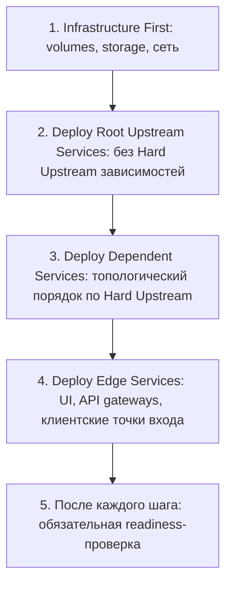
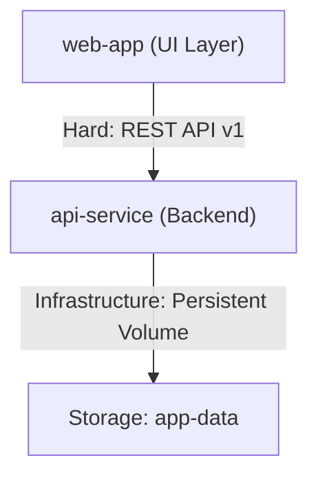
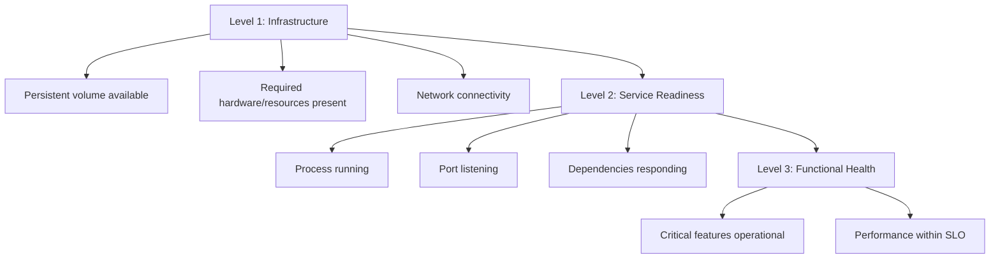
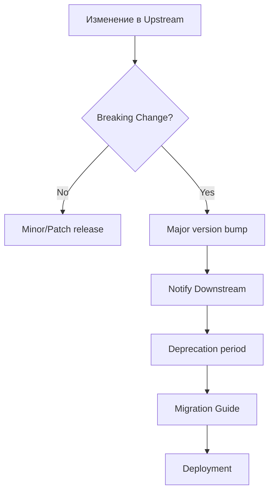
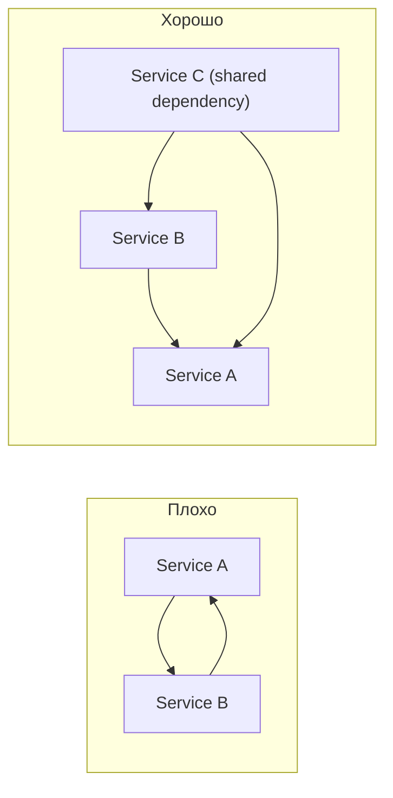

# Стандарт Управления Зависимостями Между Сервисами

[К оглавлению][backlink-index]

<!-- doc-deps
id: standard-service-dependencies
depends_on:
  - knowledge/standards/standard-specification-common-format.md
provides_for:
  - knowledge/standards/standard-service-specification.md
  - knowledge/standards/standard-feature-specification.md
  - knowledge/services/*/service-*.md
  - knowledge/features/*/feature-*.md
-->

Этот стандарт определяет подход к документированию, управлению и валидации зависимостей между сервисами в инфраструктуре проекта. Стандарт обеспечивает прозрачность связей между компонентами, безопасное управление изменениями и предсказуемый порядок развертывания.

---

## Цель

- Обеспечить видимость зависимостей между сервисами
- Определить порядок безопасного развертывания при изменениях
- Предотвратить cascading failures из-за неучтенных зависимостей
- Установить правила управления API контрактами между сервисами
- Создать механизм оценки blast radius при планировании изменений

---

## Типы Зависимостей

### Классификация по типу зависимости

| Тип                | Описание                                                   | Поведение при недоступности                       | Пример                                          |
| :----------------- | :--------------------------------------------------------- | :------------------------------------------------ | :---------------------------------------------- |
| **Hard**           | Сервис не может функционировать без зависимости            | Сервис не запускается или аварийно завершается    | `web-app` -> `api-service`                      |
| **Soft**           | Деградация функциональности, но базовая работа сохраняется | Graceful degradation, fallback к кэшу или статике | UI без analytics-сервиса                        |
| **Eventual**       | Асинхронная интеграция, допустимы задержки                 | Очередь запросов, ретраи с exponential backoff    | Event-driven архитектура                        |
| **Infrastructure** | Зависимость от инфраструктурных компонентов                | Сервис не может быть развернут                    | `host_volume`, block storage, shared filesystem |

### Классификация по направлению

| Направление    | Описание                          | Пример                                       |
| :------------- | :-------------------------------- | :------------------------------------------- |
| **Upstream**   | Сервис вызывает другой сервис     | `web-app` вызывает `api-service` API         |
| **Downstream** | Сервис получает вызовы от другого | `api-service` принимает запросы от `web-app` |

### Классификация по режиму взаимодействия

| Режим            | Описание                                  | Пример                |
| :--------------- | :---------------------------------------- | :-------------------- |
| **Synchronous**  | Блокирующий вызов с ожиданием ответа      | REST API вызовы       |
| **Asynchronous** | Неблокирующий вызов через очередь/события | Kafka, message queues |

### Классификация по критичности

| Критичность | Описание влияния                                           |
| :---------- | :--------------------------------------------------------- |
| **Critical**| Потеря ключевой функциональности или недоступность сервиса |
| **High**    | Существенная деградация критичных сценариев                |
| **Medium**  | Ограниченная деградация части функциональности             |
| **Low**     | Незначительное влияние без блокировки ключевых сценариев   |

---

## Структура Документирования

### 1. Dependency Map (Обязательный раздел)

Каждая сервисная спецификация (`service-<name>.md`) должна содержать раздел **"Зависимости"** с таблицей формата:

```markdown
## Зависимости

| Зависимость    | Тип            | Направление | Контракт/Версия              | Критичность | Проверка доступности                       |
| :------------- | :------------- | :---------- | :--------------------------- | :---------- | :----------------------------------------- |
| `api-service`  | Hard           | Upstream    | REST API v1                  | Critical    | `curl -fsS http://api-service:8080/health` |
| `orchestrator` | Infrastructure | Upstream    | Persistent volume `app-data` | Critical    | Не применимо (deploy-time)                 |
| `filesystem`   | Infrastructure | Upstream    | Mount path `/data/app`       | High        | Directory exists with correct permissions  |
```

### Поля таблицы

| Поле                     | Описание                                          | Примеры                                      |
| :----------------------- | :------------------------------------------------ | :------------------------------------------- |
| **Зависимость**          | Название сервиса или инфраструктурного компонента | `api-service`, `postgresql`, `redis`         |
| **Тип**                  | Категория зависимости (фиксированный enum)        | `Hard`, `Soft`, `Eventual`, `Infrastructure` |
| **Направление**          | Направление относительно текущего сервиса         | `Upstream`, `Downstream`                     |
| **Контракт/Версия**      | Версия API, формат данных, схема БД               | `REST API v1`, `Protobuf v3`                 |
| **Критичность**          | Степень влияния на сервис (фиксированный enum)    | `Critical`, `High`, `Medium`, `Low`          |
| **Проверка доступности** | Команда или метод проверки                        | `curl`, `nc -z`, orchestrator health check   |

### Нормативные enum-значения (обязательные)

- `Тип`: только `Hard`, `Soft`, `Eventual`, `Infrastructure`
- `Направление`: только `Upstream`, `Downstream`
- `Критичность`: только `Critical`, `High`, `Medium`, `Low`

---

## Порядок Деплоя (Deployment Order)

### Принципы формирования порядка



### Формат документирования порядка

Для feature, затрагивающей несколько сервисов, в Hub документе обязательно указать **Deployment Sequence**:

```markdown
## Deployment Sequence

| Порядок | Сервис        | Действие        | Проверка перед следующим шагом |
| :------ | :------------ | :-------------- | :----------------------------- |
| 1       | `api-service` | Deploy service  | Health check: `/health`        |
| 2       | `web-app`     | Deploy service  | UI доступен на целевом порту   |
| 3       | `smoke-tests` | Run smoke tests | Все тесты проходят             |
```

### Dependency Graph

Для сложных feature с более чем 3 сервисами рекомендуется визуализация:



---

## Blast Radius Analysis

### Определение

**Blast Radius** -- множество сервисов и функциональности, затрагиваемых изменением данного компонента.

### Формат документирования

В Hub документе фичи добавить раздел:

```markdown
## Blast Radius

Изменение `api-service` затрагивает:

### Прямые зависимости (Direct)

| Сервис       | Влияние                                        | Mitigation                           |
| :----------- | :--------------------------------------------- | :----------------------------------- |
| `web-app`    | Полная недоступность основной функциональности | Health check, graceful error message |
| `mobile-app` | Независимый клиент с кэшированием              | Offline mode (изолирован)            |

### Косвенные зависимости (Indirect)

| Сервис      | Путь влияния       | Степень риска |
| :---------- | :----------------- | :------------ |
| (End users) | `web-app` -> Users | Высокая       |

### Инфраструктурные зависимости

| Компонент           | Тип риска                        | Проверка                  |
| :------------------ | :------------------------------- | :------------------------ |
| Persistent volume   | Сервис не стартует без хранилища | Orchestrator volume check |
| Database connection | Долгий cold start                | Pre-flight migration job  |
```

### Матрица влияния (Impact Matrix)

```markdown
| Изменяемый компонент        | Downstream Impact  | User Impact | Rollback Complexity     |
| :-------------------------- | :----------------- | :---------- | :---------------------- |
| `api-service` API contract  | High (all clients) | Critical    | High (schema migration) |
| `api-service` config update | High               | Medium      | Medium (config update)  |
| `web-app` UI                | Low (independent)  | Low         | Low (quick restart)     |
```

---

## API Contract Management

### Версионирование контрактов

Использовать **Semantic Versioning** для API:

| Изменение                                              | Версия         | Требования                   |
| :----------------------------------------------------- | :------------- | :--------------------------- |
| Breaking changes (удаление полей, изменение поведения) | Major (v2.0.0) | Совместимый период, миграция |
| Новые возможности (добавление полей, эндпоинтов)       | Minor (v1.1.0) | Обратная совместимость       |
| Bug fixes, performance                                 | Patch (v1.0.1) | Полная совместимость         |

### Compatibility Matrix

Документировать в сервисе с downstream зависимостями:

```markdown
## API Compatibility Matrix

| API Version    | Совместимые клиенты | Примечания                      |
| :------------- | :------------------ | :------------------------------ |
| v1.0           | `web-app` 1.x       | Базовая поддержка               |
| v1.1           | `web-app` 2.x       | Добавлен streaming              |
| v2.0 (planned) | `web-app` 3.x+      | Breaking: изменен формат ответа |
```

### Deprecation Policy

```markdown
## Deprecation Policy

1. **Announcement:** Минимум 30 дней до deprecation
2. **Sunset Period:** 90 дней поддержки deprecated версии
3. **Communication:** Уведомление в канал деплоя / общий канал команды
4. **Monitoring:** Трекинг использования deprecated endpoints

| Endpoint           | Deprecated Since | Sunset Date | Replacement        |
| :----------------- | :--------------- | :---------- | :----------------- |
| `POST /v1/process` | YYYY-MM-DD       | YYYY-MM-DD  | `POST /v2/process` |
```

---

## Validation и Health Checks

### Health Check Hierarchy



### Зависимостно-специфичные проверки

В спецификации сервиса (`service-<name>.md`):

```markdown
## Зависимости Health Checks

### Upstream: `api-service`

| Проверка   | Команда                                    | Частота    | Таймаут |
| :--------- | :----------------------------------------- | :--------- | :------ |
| Liveness   | `curl -fsS http://api-service:8080/health` | При старте | 5s      |
| Readiness  | `curl -fsS http://api-service:8080/ready`  | 10s        | 10s     |
| Functional | Тестовый запрос к основному endpoint       | 60s        | 30s     |

### Infrastructure: persistent volume

| Проверка      | Команда                        | Когда выполнять |
| :------------ | :----------------------------- | :-------------- |
| Volume exists | Orchestrator volume constraint | Plan phase      |
| Permissions   | `test -w /data/app`            | Pre-start task  |
| Capacity      | `df -h`                        | Continuous      |
```

### Зависимости Startup Order

Для контроля порядка запуска используется pre-start проверка зависимостей. Конкретный синтаксис зависит от используемого оркестратора:

- **Nomad** -- `lifecycle` hook с `hook = "prestart"`
- **Kubernetes** -- init containers
- **Docker Compose** -- `depends_on` + `healthcheck`

Общий паттерн: перед запуском основного процесса выполнить вспомогательную задачу, которая ожидает готовности зависимости.

```yaml
# Псевдокод (generic orchestrator pattern)

service-group:
  # Pre-start task: проверка зависимостей
  pre-start:
    name: wait-for-deps
    command: |
      until curl -fsS http://api-service:8080/health; do
        sleep 5
      done

  # Main application task
  main:
    name: app
    # ...
```

---

## Integration Testing Зависимостей

### Contract Testing

Проверка совместимости между сервисами:

```markdown
## Integration Test: `web-app` -> `api-service`

### Prerequisites

- `api-service` запущен и доступен по целевому адресу
- `web-app` сконфигурирован с правильным URL backend-сервиса

### Test Cases

| ID      | Описание             | Команда/Шаги                                                                                             | Ожидаемый результат                                                                  |
| :------ | :------------------- | :------------------------------------------------------------------------------------------------------- | :----------------------------------------------------------------------------------- |
| INT-001 | Health cascade       | 1. `api-service` healthy<br>2. Start `web-app`<br>3. Check UI                                            | UI показывает статус "Backend Available"                                             |
| INT-002 | Graceful degradation | 1. Stop `api-service`<br>2. Попытка действия в UI                                                        | UI показывает ошибку подключения, сохраняется возможность просмотра локальных данных |
| INT-003 | Recovery             | 1. Stop `api-service`<br>2. Попытка действия (ожидание ошибки)<br>3. Start `api-service`<br>4. Повторить | После восстановления `api-service` функциональность работает                         |
```

### Automated Contract Tests

Использовать для критичных зависимостей:

```bash
#!/bin/bash
# scripts/test_dependency_contract.sh

set -euo pipefail

BACKEND_URL="${BACKEND_URL:-http://api-service:8080}"
FRONTEND_URL="${FRONTEND_URL:-http://web-app:3000}"

echo "=== Testing Backend Dependency ==="

# Test 1: Direct backend health
curl -fsS "${BACKEND_URL}/health" > /dev/null && echo "OK: Backend healthy"

# Test 2: API contract validation
curl -fsS "${BACKEND_URL}/v1/status" | jq -e '.status' > /dev/null && echo "OK: API contract valid"

# Test 3: Integration through frontend
# (requires test user setup and API endpoint configuration)

exit 0
```

---

## Change Management для Зависимостей

### Процесс изменения контракта



### Рассмотрение Downstream Impact

При планировании изменений в upstream сервисе:

```markdown
## Change Request: `api-service` API v2

### Blast Radius Checklist

- [ ] Список всех downstream сервисов идентифицирован
- [ ] Совместимость с каждым downstream проверена
- [ ] Deprecation timeline согласован с командами
- [ ] Rollback plan подготовлен
- [ ] Integration tests обновлены

### Downstream Impact

| Сервис       | Владелец       | Совместимость | Действия                   |
| :----------- | :------------- | :------------ | :------------------------- |
| `web-app`    | @team-frontend | Breaking      | Обновить до v2 client SDK  |
| `mobile-app` | @team-mobile   | Breaking      | Уведомить, deprecation 90d |
```

---

## Checklist для Нового Сервиса

При создании спецификации нового сервиса:

### Зависимости

- [ ] Определены все upstream зависимости (Hard, Soft, Eventual)
- [ ] Определены все infrastructure зависимости (volumes, storage, network)
- [ ] Документирован порядок деплоя
- [ ] Документированы команды проверки доступности каждой зависимости

### Контракты

- [ ] Документированы все API endpoints (если предоставляет)
- [ ] Указана версия и формат контракта
- [ ] Задокументированы breaking changes (если миграция)

### Тестирование

- [ ] Integration tests для всех Hard зависимостей
- [ ] Health checks настроены в конфигурации оркестратора
- [ ] Graceful degradation протестирован для Soft зависимостей

### Blast Radius

- [ ] Определены downstream зависимости (кто вызывает этот сервис)
- [ ] Оценен impact изменений этого сервиса
- [ ] Подготовлен rollback plan

---

## Best Practices

### 1. Избегайте циклических зависимостей



### 2. Resilience Controls для Hard зависимостей

Для критичных upstream зависимостей:

```text
Минимальный baseline:
- Timeout на вызов зависимости
- Retry с exponential backoff и ограничением попыток
- Circuit breaker (Open после N неудач, Half-Open probe)
- Fallback поведение (если применимо)
```

### 3. Async для Eventual зависимостей

```markdown
Для Eventual зависимостей рекомендуется:
- Message queues вместо синхронных вызовов
- Retry policy с exponential backoff
- Dead letter queue для failed messages
- Idempotency keys для повторных попыток
```

### 4. Dependency Inversion Principle

```markdown
Сервисы верхнего уровня не должны зависеть от деталей реализации
сервисов нижнего уровня. Оба должны зависеть от абстракций (API контрактов).
```

### 5. Изоляция критичных зависимостей

```text
Если Service A имеет Hard зависимость от Service B:
- Развертывать их в одной зоне доступности / одном кластере
- Использовать affinity/anti-affinity rules при необходимости
- Мониторить как единую unit of deployment
```

---

## Примеры

### Пример 1: Frontend-сервис с backend-зависимостью

```markdown
## Зависимости

| Зависимость    | Тип            | Направление | Контракт                     | Критичность | Проверка                                   |
| :------------- | :------------- | :---------- | :--------------------------- | :---------- | :----------------------------------------- |
| `api-service`  | Hard           | Upstream    | REST API v1                  | Critical    | `curl -fsS http://api-service:8080/health` |
| `orchestrator` | Infrastructure | Upstream    | Persistent volume `app-data` | Critical    | Orchestrator constraint                    |
| `storage`      | Infrastructure | Upstream    | Mount path `/data/app`       | High        | Pre-start check                            |
| `host-network` | Infrastructure | Upstream    | Target port available        | High        | Netstat check                              |

## Deployment Sequence

| Порядок | Компонент     | Действие                 | Проверка                     |
| :------ | :------------ | :----------------------- | :--------------------------- |
| 1       | Storage       | Создать если отсутствует | `ls -ld /data/app`           |
| 2       | Volume config | Проверить конфигурацию   | Orchestrator volume check    |
| 3       | `api-service` | Запустить backend        | Health check проходит        |
| 4       | `web-app`     | Deploy frontend          | UI доступен на целевом порту |
| 5       | Integration   | Smoke test               | Ответ от backend получен     |

## Blast Radius

Изменение компонентов затрагивает:

- `api-service` обновление -> Полная недоступность основной функциональности в UI
- Storage конфигурация -> Потеря persistent data
- Целевой порт занят -> Сервис не запустится
```

### Пример 2: Backend-сервис с инфраструктурными зависимостями

```markdown
## Зависимости

| Зависимость     | Тип            | Направление | Контракт                   | Критичность | Проверка               |
| :-------------- | :------------- | :---------- | :------------------------- | :---------- | :--------------------- |
| `database`      | Hard           | Upstream    | PostgreSQL 15+, schema v3  | Critical    | `pg_isready`           |
| `cache`         | Soft           | Upstream    | Redis 7+                   | Medium      | `redis-cli ping`       |
| `storage`       | Infrastructure | Upstream    | Mount path `/data/service` | High        | Pre-start check        |
| `config-server` | Soft           | Upstream    | Config API v1              | Medium      | Cached config fallback |

## Deployment Sequence

| Порядок | Компонент       | Действие                 | Проверка            |
| :------ | :-------------- | :----------------------- | :------------------ |
| 1       | `database`      | Проверить версию и схему | `pg_isready`        |
| 2       | `cache`         | Проверить доступность    | `redis-cli ping`    |
| 3       | Storage         | Создать если отсутствует | Directory exists    |
| 4       | `config-server` | Проверить конфигурацию   | Config API responds |
| 5       | `api-service`   | Deploy backend           | Health check passes |

## Blast Radius

Downstream (клиенты через API):
- `web-app` -- frontend-приложение
- `mobile-app` -- мобильное приложение
- Внешние клиенты (через API gateway)
```

---

## Связь с Другими Стандартами

| Стандарт                                            | Как взаимодействует                                      |
| :-------------------------------------------------- | :------------------------------------------------------- |
| [Service Specification Standard][standard-services] | Содержит раздел "Зависимости" с Dependency Map           |
| [Feature Specification Standard][standard-features] | Hub документ содержит Deployment Sequence и Blast Radius |

---

## Changelog

| Дата       | Версия | Изменения                       |
| :--------- | :----- | :------------------------------ |
| YYYY-MM-DD | 1.0.0  | Первоначальная версия стандарта |

---

[standard-services]: ./standard-service-specification.md
[standard-features]: ./standard-feature-specification.md
[backlink-index]: ./INDEX.md
