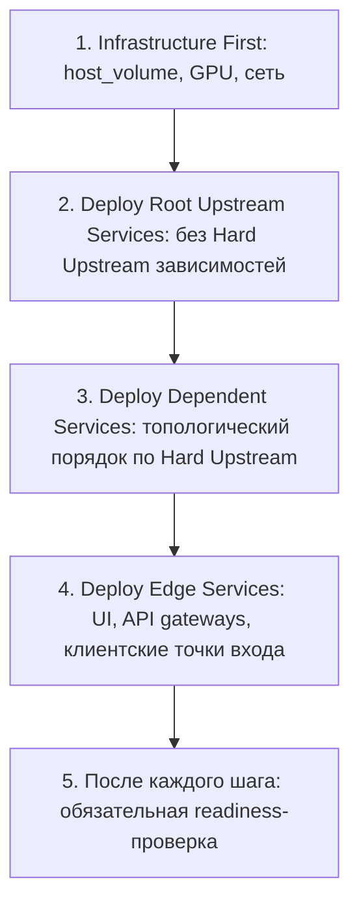
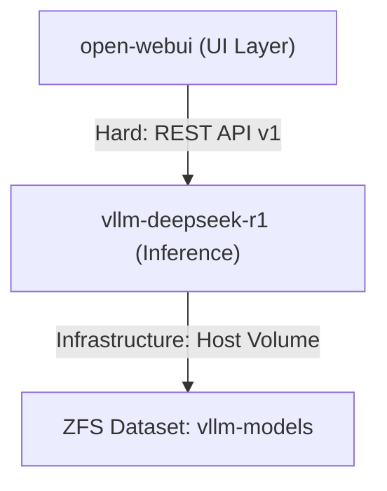
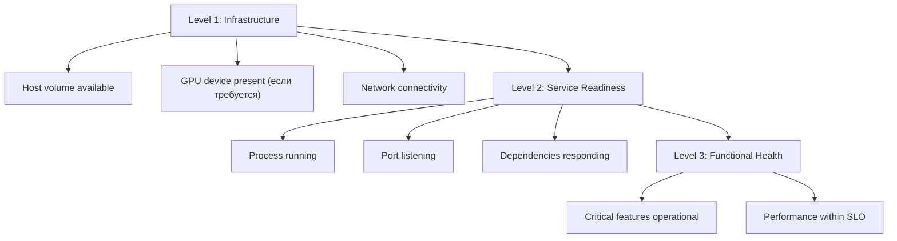
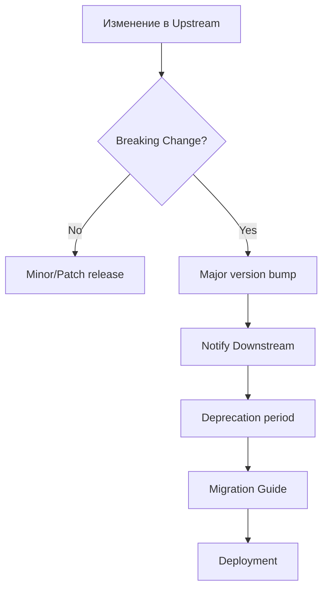
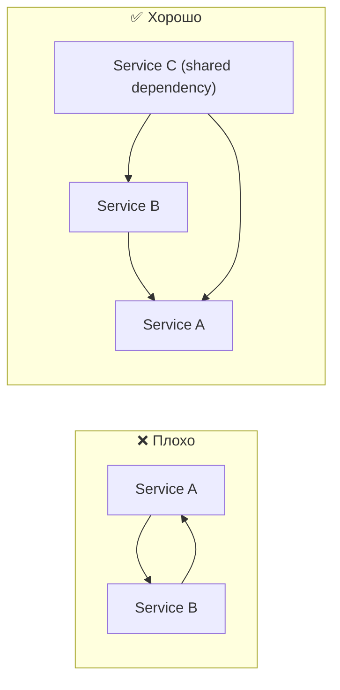

# 📋 Стандарт Управления Зависимостями Между Сервисами

[⬅️ К оглавлению][backlink-index]

<!-- doc-deps
id: standard-service-dependencies
depends_on:
  - knowledge/standards/standard-specification-common-format.md
provides_for:
  - knowledge/standards/standard-service-specification.md
  - knowledge/standards/standard-feature-specification.md
  - knowledge/services/*/service-*.md
  - knowledge/features/*/feature-*.md
-->

Этот стандарт определяет подход к документированию, управлению и валидации зависимостей между сервисами в инфраструктуре `pihanya-hawk`. Стандарт обеспечивает прозрачность связей между компонентами, безопасное управление изменениями и предсказуемый порядок развертывания.

---

## 📘 Цель

- Обеспечить видимость зависимостей между сервисами
- Определить порядок безопасного развертывания при изменениях
- Предотвратить cascading failures из-за неучтенных зависимостей
- Установить правила управления API контрактами между сервисами
- Создать механизм оценки blast radius при планировании изменений

---

## 🏗️ Типы Зависимостей

### Классификация по типу зависимости

| Тип                | Описание                                                   | Поведение при недоступности                       | Пример                    |
| :----------------- | :--------------------------------------------------------- | :------------------------------------------------ | :------------------------ |
| **Hard**           | Сервис не может функционировать без зависимости            | Сервис не запускается или аварийно завершается    | `open-webui` → `vllm`     |
| **Soft**           | Деградация функциональности, но базовая работа сохраняется | Graceful degradation, fallback к кэшу или статике | UI без analytics сервиса  |
| **Eventual**       | Асинхронная интеграция, допустимы задержки                 | Очередь запросов, ретраи с exponential backoff    | Event-driven архитектура  |
| **Infrastructure** | Зависимость от инфраструктурных компонентов                | Сервис не может быть развернут                    | `host_volume`, GPU device |

### Классификация по направлению

| Направление    | Описание                          | Пример                                   |
| :------------- | :-------------------------------- | :--------------------------------------- |
| **Upstream**   | Сервис вызывает другой сервис     | `open-webui` вызывает `vllm` API         |
| **Downstream** | Сервис получает вызовы от другого | `vllm` принимает запросы от `open-webui` |

### Классификация по режиму взаимодействия

| Режим            | Описание                                  | Пример                |
| :--------------- | :---------------------------------------- | :-------------------- |
| **Synchronous**  | Блокирующий вызов с ожиданием ответа      | REST API вызовы       |
| **Asynchronous** | Неблокирующий вызов через очередь/события | Kafka, message queues |

### Классификация по критичности

| Критичность | Описание влияния                                           |
| :---------- | :--------------------------------------------------------- |
| **Critical**| Потеря ключевой функциональности или недоступность сервиса |
| **High**    | Существенная деградация критичных сценариев                |
| **Medium**  | Ограниченная деградация части функциональности             |
| **Low**     | Незначительное влияние без блокировки ключевых сценариев   |

---

## 📂 Структура Документирования

### 1. Dependency Map (Обязательный раздел)

Каждая сервисная спецификация (`service-<name>.md`) должна содержать раздел **"🔗 Зависимости"** с таблицей формата:

```markdown
## 🔗 Зависимости

| Зависимость        | Тип            | Направление | Контракт/Версия                      | Критичность | Проверка доступности                               |
| :----------------- | :------------- | :---------- | :----------------------------------- | :---------- | :------------------------------------------------- |
| `vllm-deepseek-r1` | Hard           | Upstream    | REST API v1                          | Critical    | `curl -fsS http://pihanya-hawk.local:18000/health` |
| `nomad`            | Infrastructure | Upstream    | Host volume `open-webui-data`        | Critical    | Не применимо (deploy-time)                         |
| `zfs`              | Infrastructure | Upstream    | Dataset `/data/hawk/data/open-webui` | High        | Directory exists with correct permissions          |
```

### Поля таблицы

| Поле                     | Описание                                          | Примеры                                      |
| :----------------------- | :------------------------------------------------ | :------------------------------------------- |
| **Зависимость**          | Название сервиса или инфраструктурного компонента | `vllm`, `nomad`, `postgresql`                |
| **Тип**                  | Категория зависимости (фиксированный enum)        | `Hard`, `Soft`, `Eventual`, `Infrastructure` |
| **Направление**          | Направление относительно текущего сервиса         | `Upstream`, `Downstream`                     |
| **Контракт/Версия**      | Версия API, формат данных, схема БД               | `REST API v1`, `Protobuf v3`                 |
| **Критичность**          | Степень влияния на сервис (фиксированный enum)    | `Critical`, `High`, `Medium`, `Low`          |
| **Проверка доступности** | Команда или метод проверки                        | `curl`, `nc -z`, Nomad health check          |

### Нормативные enum-значения (обязательные)

- `Тип`: только `Hard`, `Soft`, `Eventual`, `Infrastructure`
- `Направление`: только `Upstream`, `Downstream`
- `Критичность`: только `Critical`, `High`, `Medium`, `Low`

---

## 🔄 Порядок Деплоя (Deployment Order)

### Принципы формирования порядка



### Формат документирования порядка

Для feature, затрагивающей несколько сервисов, в Hub документе обязательно указать **Deployment Sequence**:

```markdown
## 🚀 Deployment Sequence

| Порядок | Сервис             | Действие        | Проверка перед следующим шагом |
| :------ | :----------------- | :-------------- | :----------------------------- |
| 1       | `vllm-deepseek-r1` | Deploy jobspec  | Health check: `/health`        |
| 2       | `open-webui`       | Deploy jobspec  | UI доступен на порту 8080      |
| 3       | `integration-test` | Run smoke tests | Все тесты проходят             |
```

### Dependency Graph

Для сложных feature с более чем 3 сервисами рекомендуется визуализация:



---

## 💥 Blast Radius Analysis

### Определение

**Blast Radius** — множество сервисов и функциональности, затрагиваемых изменением данного компонента.

### Формат документирования

В Hub документе фичи добавить раздел:

```markdown
## 💥 Blast Radius

Изменение `vllm-deepseek-r1` затрагивает:

### Прямые зависимости (Direct)

| Сервис       | Влияние                                | Mitigation                           |
| :----------- | :------------------------------------- | :----------------------------------- |
| `open-webui` | Полная недоступность генерации ответов | Health check, graceful error message |
| `llamacpp`   | Независимый inference endpoint         | None (изолирован)                    |

### Косвенные зависимости (Indirect)

| Сервис      | Путь влияния         | Степень риска |
| :---------- | :------------------- | :------------ |
| (End users) | `open-webui` → Users | Высокая       |

### Инфраструктурные зависимости

| Компонент            | Тип риска                  | Проверка                  |
| :------------------- | :------------------------- | :------------------------ |
| GPU device           | Сервис не стартует без GPU | `nomad node status`       |
| `vllm-models` volume | Долгий cold start          | Pre-flight downloader job |
```

### Матрица влияния (Impact Matrix)

```markdown
| Изменяемый компонент | Downstream Impact  | User Impact | Rollback Complexity    |
| :------------------- | :----------------- | :---------- | :--------------------- |
| `vllm` API contract  | High (all clients) | Critical    | High (model reload)    |
| `vllm` model version | High               | Medium      | Medium (config update) |
| `open-webui` UI      | Low (independent)  | Low         | Low (quick restart)    |
```

---

## 📜 API Contract Management

### Версионирование контрактов

Использовать **Semantic Versioning** для API:

| Изменение                                              | Версия         | Требования                   |
| :----------------------------------------------------- | :------------- | :--------------------------- |
| Breaking changes (удаление полей, изменение поведения) | Major (v2.0.0) | Совместимый период, миграция |
| Новые возможности (добавление полей, эндпоинтов)       | Minor (v1.1.0) | Обратная совместимость       |
| Bug fixes, performance                                 | Patch (v1.0.1) | Полная совместимость         |

### Compatibility Matrix

Документировать в сервисе с downstream зависимостями:

```markdown
## 📋 API Compatibility Matrix

| API Version    | `open-webui` версии | Примечания                      |
| :------------- | :------------------ | :------------------------------ |
| v1.0           | 0.7.x               | Базовая поддержка               |
| v1.1           | 0.8.x               | Добавлен streaming              |
| v2.0 (planned) | 0.9.x+              | Breaking: изменен формат ответа |
```

### Deprecation Policy

```markdown
## 🚫 Deprecation Policy

1. **Announcement:** Минимум 30 дней до deprecation
2. **Sunset Period:** 90 дней поддержки deprecated версии
3. **Communication:** Уведомление в `#deployments` канал
4. **Monitoring:** Трекинг использования deprecated endpoints

| Endpoint            | Deprecated Since | Sunset Date | Replacement                 |
| :------------------ | :--------------- | :---------- | :-------------------------- |
| `POST /v1/generate` | 2026-01-01       | 2026-04-01  | `POST /v1/chat/completions` |
```

---

## ✅ Validation и Health Checks

### Health Check Hierarchy



### Зависимостно-специфичные проверки

В спецификации сервиса (`service-<name>.md`):

```markdown
## ✅ Зависимости Health Checks

### Upstream: `vllm-deepseek-r1`

| Проверка   | Команда                                               | Частота    | Таймаут |
| :--------- | :---------------------------------------------------- | :--------- | :------ |
| Liveness   | `curl -fsS http://pihanya-hawk.local:18000/health`    | При старте | 5s      |
| Readiness  | `curl -fsS http://pihanya-hawk.local:18000/v1/models` | 10s        | 10s     |
| Functional | Тестовый запрос inference                             | 60s        | 30s     |

### Infrastructure: `host_volume`

| Проверка      | Команда              | Когда выполнять |
| :------------ | :------------------- | :-------------- |
| Volume exists | Nomad job constraint | Plan phase      |
| Permissions   | `test -w /data/...`  | Pre-start task  |
| Capacity      | `df -h`              | Continuous      |
```

### Зависимости Startup Order в Nomad

Использовать `lifecycle` hook для инициализации:

```hcl
group "service-group" {
  # Pre-start task: проверка зависимостей
  task "wait-for-deps" {
    lifecycle {
      hook = "prestart"
      sidecar = false
    }
    driver = "raw_exec"
    config {
      command = "/bin/bash"
      args = ["-c", "until curl -fsS http://vllm:18000/health; do sleep 5; done"]
    }
  }
  
  # Main application task
  task "app" {
    # ...
  }
}
```

---

## 🧪 Integration Testing Зависимостей

### Contract Testing

Проверка совместимости между сервисами:

```markdown
## 🧪 Integration Test: `open-webui` → `vllm`

### Prerequisites

- `vllm-deepseek-r1` запущен и доступен на `192.168.1.99:18000`
- `open-webui` сконфигурирован с правильным `OPENAI_API_BASE_URL`

### Test Cases

| ID      | Описание             | Команда/Шаги                                                                               | Ожидаемый результат                                                         |
| :------ | :------------------- | :----------------------------------------------------------------------------------------- | :-------------------------------------------------------------------------- |
| INT-001 | Health cascade       | 1. `vllm` healthy<br>2. Start `open-webui`<br>3. Check UI                                  | UI показывает статус "Backend Available"                                    |
| INT-002 | Graceful degradation | 1. Stop `vllm`<br>2. Попытка чата в UI                                                     | UI показывает ошибку подключения, сохраняется возможность просмотра истории |
| INT-003 | Recovery             | 1. Stop `vllm`<br>2. Попытка чата (ожидание ошибки)<br>3. Start `vllm`<br>4. Повторить чат | После восстановления `vllm` чат работает                                    |
```

### Automated Contract Tests

Использовать для критичных зависимостей:

```bash
#!/bin/bash
# scripts/test_dependency_openwebui_vllm.sh

set -euo pipefail

VLLM_URL="http://192.168.1.99:18000"
WEBUI_URL="http://192.168.1.99:8080"

echo "=== Testing vLLM Dependency ==="

# Test 1: Direct vLLM health
curl -fsS "${VLLM_URL}/health" > /dev/null && echo "✓ vLLM healthy"

# Test 2: vLLM API contract
curl -fsS "${VLLM_URL}/v1/models" | jq -e '.data[].id' > /dev/null && echo "✓ API contract valid"

# Test 3: Integration through Open WebUI
# (требует настройки тестового пользователя и API endpoint)

exit 0
```

---

## 🔄 Change Management для Зависимостей

### Процесс изменения контракта



### Рассмотрение Downstream Impact

При планировании изменений в upstream сервисе:

```markdown
## 🔍 Change Request: `vllm` API v2

### Blast Radius Checklist

- [ ] Список всех downstream сервисов идентифицирован
- [ ] Совместимость с каждым downstream проверена
- [ ] Deprecation timeline согласован с командами
- [ ] Rollback plan подготовлен
- [ ] Integration tests обновлены

### Downstream Impact

| Сервис          | Владелец  | Совместимость | Действия                   |
| :-------------- | :-------- | :------------ | :------------------------- |
| `open-webui`    | @admin    | Breaking      | Обновить до v0.8+          |
| `custom-client` | @external | Breaking      | Уведомить, deprecation 90d |
```

---

## 📋 Checklist для Нового Сервиса

При создании спецификации нового сервиса:

### Зависимости

- [ ] Определены все upstream зависимости (Hard, Soft, Eventual)
- [ ] Определены все infrastructure зависимости (volumes, GPU, network)
- [ ] Документирован порядок деплоя
- [ ] Документированы команды проверки доступности каждой зависимости

### Контракты

- [ ] Документированы все API endpoints (если предоставляет)
- [ ] Указана версия и формат контракта
- [ ] Задокументированы breaking changes (если миграция)

### Тестирование

- [ ] Integration tests для всех Hard зависимостей
- [ ] Health checks настроены в Nomad jobspec
- [ ] Graceful degradation протестирован для Soft зависимостей

### Blast Radius

- [ ] Определены downstream зависимости (кто вызывает этот сервис)
- [ ] Оценен impact изменений этого сервиса
- [ ] Подготовлен rollback plan

---

## 🏆 Best Practices

### 1. Избегайте циклических зависимостей



### 2. Resilience Controls для Hard зависимостей

Для критичных upstream зависимостей:

```text
Минимальный baseline:
- Timeout на вызов зависимости
- Retry с exponential backoff и ограничением попыток
- Circuit breaker (Open после N неудач, Half-Open probe)
- Fallback поведение (если применимо)
```

### 3. Async для Eventual зависимостей

```markdown
Для Eventual зависимостей рекомендуется:
- Message queues вместо синхронных вызовов
- Retry policy с exponential backoff
- Dead letter queue для failed messages
- Idempotency keys для повторных попыток
```

### 4. Dependency Inversion Principle

```markdown
Сервисы верхнего уровня не должны зависеть от деталей реализации
сервисов нижнего уровня. Оба должны зависеть от абстракций (API контрактов).
```

### 5. Изоляция критичных зависимостей

```text
Если Service A имеет Hard зависимость от Service B:
- Развертывать их в одном Nomad datacenter
- Использовать affinity/anti-affinity rules при необходимости
- Мониторить как единую unit of deployment
```

---

## 📚 Примеры из Проекта

### Пример 1: `open-webui` Dependencies

```markdown
## 🔗 Зависимости

| Зависимость        | Тип            | Направление | Контракт                             | Критичность | Проверка                                           |
| :----------------- | :------------- | :---------- | :----------------------------------- | :---------- | :------------------------------------------------- |
| `vllm-deepseek-r1` | Hard           | Upstream    | REST API v1                          | Critical    | `curl -fsS http://pihanya-hawk.local:18000/health` |
| `nomad`            | Infrastructure | Upstream    | Host volume `open-webui-data`        | Critical    | Nomad constraint                                   |
| `zfs`              | Infrastructure | Upstream    | Dataset `/data/hawk/data/open-webui` | High        | Pre-start check                                    |
| `host-network`     | Infrastructure | Upstream    | Port 8080 доступен                   | High        | Netstat check                                      |

## 🚀 Deployment Sequence

| Порядок | Компонент          | Действие                 | Проверка                            |
| :------ | :----------------- | :----------------------- | :---------------------------------- |
| 1       | ZFS dataset        | Создать если отсутствует | `ls -ld /data/hawk/data/open-webui` |
| 2       | Nomad volume       | Проверить конфигурацию   | `nomad node status -self -verbose`  |
| 3       | `vllm-deepseek-r1` | Запустить inference      | Health check проходит               |
| 4       | `open-webui`       | Deploy jobspec           | UI доступен на 8080                 |
| 5       | Integration        | Smoke test chat          | Ответ от модели получен             |

## 💥 Blast Radius

Изменение компонентов затрагивает:

- `vllm-deepseek-r1` обновление → Полная недоступность генерации в UI
- ZFS dataset конфигурация → Потеря persistent data
- Port 8080 занят → Сервис не запустится
```

### Пример 2: `vllm-deepseek-r1` Dependencies

```markdown
## 🔗 Зависимости

| Зависимость     | Тип            | Направление | Контракт                         | Критичность | Проверка                  |
| :-------------- | :------------- | :---------- | :------------------------------- | :---------- | :------------------------ |
| `nomad`         | Infrastructure | Upstream    | GPU device plugin                | Critical    | `nomad node status -self` |
| `nvidia-driver` | Infrastructure | Upstream    | CUDA 13.1+                       | Critical    | `nvidia-smi`              |
| `zfs`           | Infrastructure | Upstream    | Dataset `/data/hawk/models/vllm` | High        | Pre-start check           |
| `huggingface`   | Soft           | Upstream    | Model download                   | Medium      | Cached model fallback     |

## 🚀 Deployment Sequence

| Порядок | Компонент          | Действие                 | Проверка                |
| :------ | :----------------- | :----------------------- | :---------------------- |
| 1       | NVIDIA driver      | Проверить версию         | `nvidia-smi`            |
| 2       | Nomad GPU          | Проверить device plugin  | `nomad node status`     |
| 3       | ZFS dataset        | Создать если отсутствует | Directory exists        |
| 4       | Model cache        | Pre-download (one-time)  | Downloader job complete |
| 5       | `vllm-deepseek-r1` | Deploy inference         | Health + model loaded   |

## 💥 Blast Radius

Этот сервис не имеет downstream зависимостей в текущей конфигурации.
Изменения влияют только на клиентов через API контракт.

Downstream (клиенты через API):
- `open-webui` — UI для пользователей
- Внешние клиенты (прямые вызовы к порту 18000)
```

---

## 🔗 Связь с Другими Стандартами

| Стандарт                                            | Как взаимодействует                                      |
| :-------------------------------------------------- | :------------------------------------------------------- |
| [Service Specification Standard][standard-services] | Содержит раздел "🔗 Зависимости" с Dependency Map         |
| [Feature Specification Standard][standard-features] | Hub документ содержит Deployment Sequence и Blast Radius |

---

## 📝 Changelog

| Дата       | Версия | Изменения                                                                     |
| :--------- | :----- | :---------------------------------------------------------------------------- |
| 2026-02-01 | 1.1.0  | Нормализованы поля зависимостей, уточнен deployment order, обновлены практики |
| 2026-02-02 | 1.0.0  | Первоначальная версия стандарта                                               |

---

[standard-services]: ./standard-service-specification.md
[standard-features]: ./standard-feature-specification.md
[backlink-index]: ./INDEX.md
