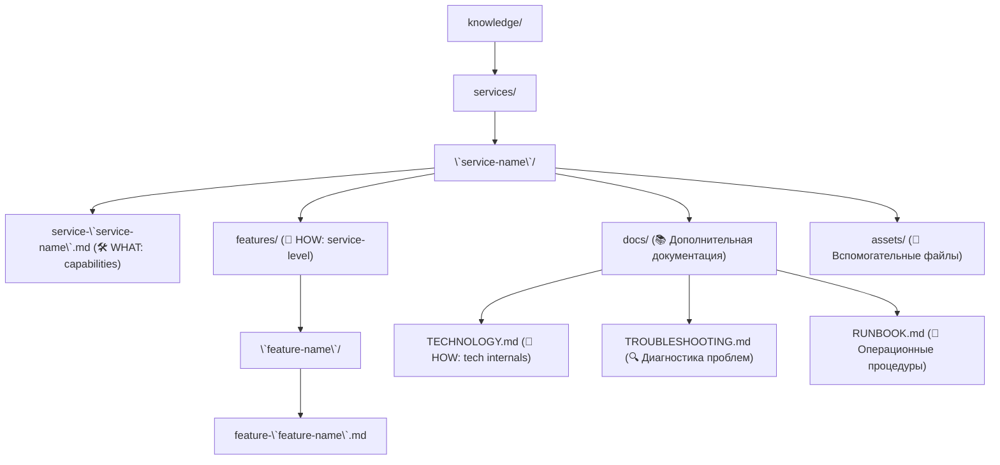
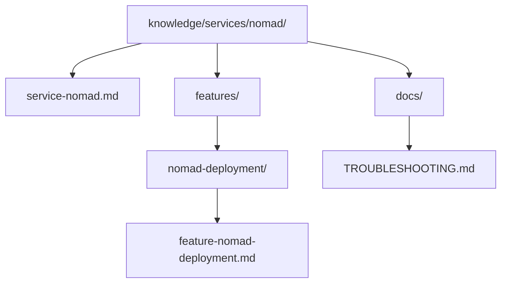
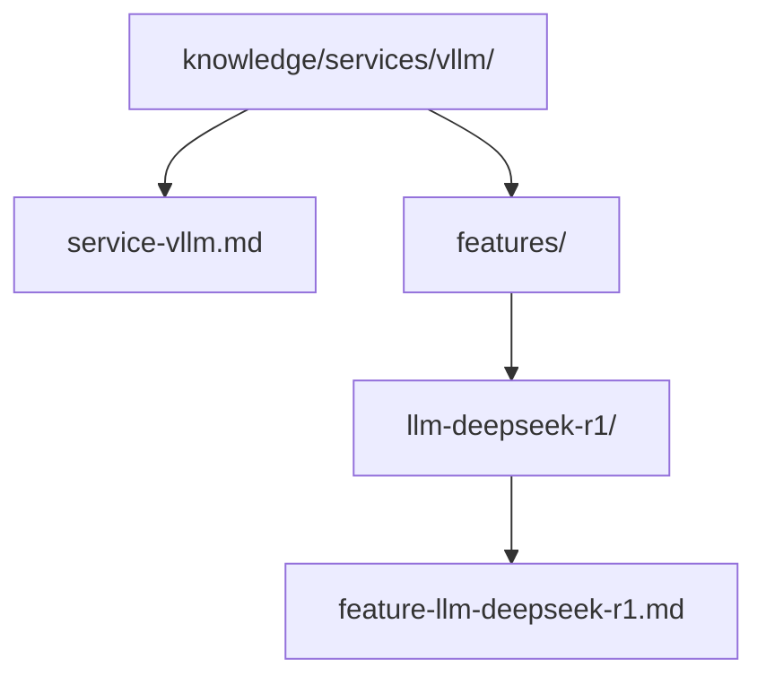
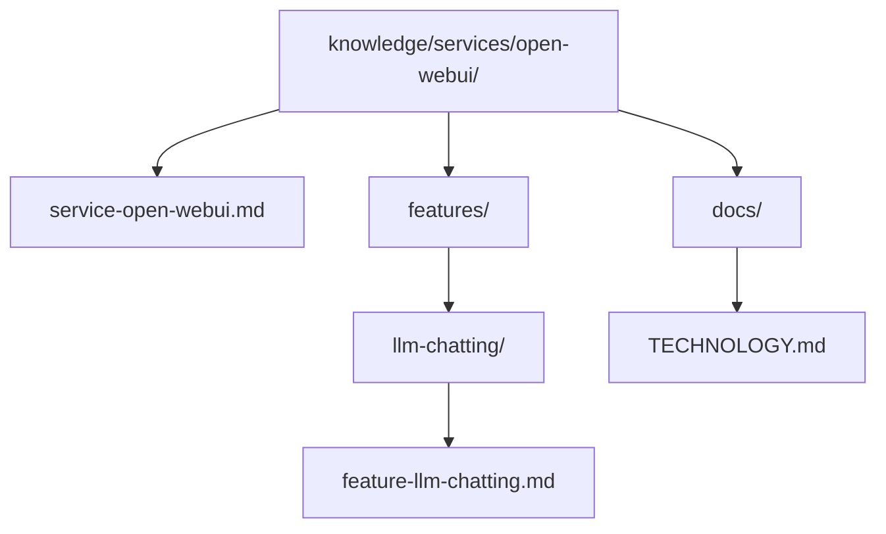
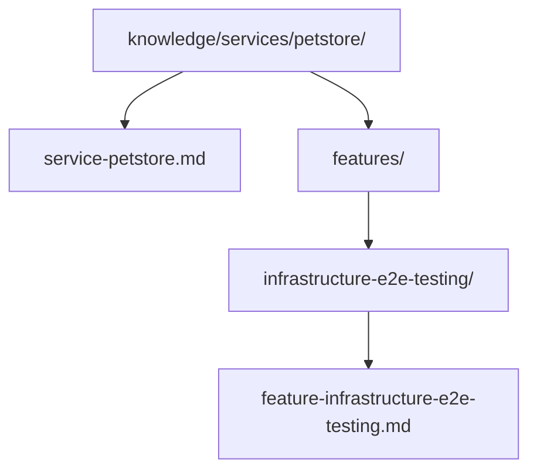

# 📋 Стандарт специфицирования сервисов

[⬅️ К оглавлению][backlink-index]

<!-- doc-deps
id: standard-service-specification
depends_on:
  - knowledge/standards/standard-specification-common-format.md
provides_for:
  - knowledge/services/*/service-*.md
-->

Этот стандарт описывает структуру и содержание документации для сервисов, расположенных в директории `knowledge/services/`. Каждый сервис представляет собой логическую единицу системы, которая может быть развернута через Nomad, Docker Compose или напрямую на хосте.

Основной документ спецификации должен называться `service-<service-name>.md` и находиться в корне директории сервиса.

**Связь с другими стандартами:**

- **Общий формат:** Спецификации сервисов следуют [Стандарту общего формата][standard-common-format] для структуры документа, метаданных и навигации.
- **Зависимости:** Для документирования зависимостей между сервисами см. [Стандарт управления зависимостями][standard-dependencies].
- **Фичи:** Сервисы реализуют фичи (features). Подробнее о Hub-and-Node паттерне см. [Стандарт специфицирования фичей][standard-features].

---

## 📌 Scope Boundaries (Области ответственности)

### Service Specification — ДОЛЖНА содержать

- [ ] **Цель сервиса:** Что делает, какую задачу решает (business-level)
- [ ] **Возможности (Capabilities):** Что сервис умеет делать
- [ ] **API Интерфейсы:** Порты, протоколы, endpoints (контракты)
- [ ] **Зависимости:** Dependency Map (Hard/Soft/Infrastructure)
- [ ] **Node Resources:** Базовые требования к ресурсам
- [ ] **Deployment:** Prerequisites + commands + jobspec location
- [ ] **Configuration:** Environment variables и ключевые параметры
- [ ] **Validation Tests:** Post-deployment checklist

### Service Specification — НЕ ДОЛЖНА содержать

- [ ] **Technology internals:** Как работает технология "под капотом" (CUDA, quantization, driver details)
- [ ] **Deep dive параметров:** Детальное объяснение каждого параметра и trade-offs
- [ ] **Operational runbooks:** Backup/restore, disaster recovery, maintenance procedures
- [ ] **Troubleshooting:** Диагностика и решение проблем
- [ ] **Raw Docker/Compose:** Docker команды вне контекста Nomad

> **Правило:** Service Spec отвечает на вопрос **"Что сервис умеет и как его развернуть?"**.
> Для technology internals → `docs/TECHNOLOGY.md`.
> Для operational procedures → `docs/RUNBOOK.md` или `docs/BACKUP-RESTORE.md`.
> Для troubleshooting → `docs/TROUBLESHOOTING.md`.

---

## 📂 Структура директории сервиса



### Разделение ответственности по файлам

| Файл                      | Уровень        | Содержание                          | Аудитория          |
| :------------------------ | :------------- | :---------------------------------- | :----------------- |
| `service-*.md`            | Capabilities   | Что умеет, API, зависимости, деплой | DevOps, Developers |
| `docs/TECHNOLOGY.md`      | Implementation | Как работает технология, параметры  | SRE, DevOps        |
| `docs/RUNBOOK.md`         | Operations     | Backup, restore, maintenance        | SRE, Operations    |
| `docs/TROUBLESHOOTING.md` | Operations     | Диагностика, решение проблем        | SRE, Support       |
| `features/*/feature-*.md` | Capabilities   | Реализация конкретной фичи          | Developers         |

---

## 📄 Шаблон спецификации (service-\<service-name>.md)

Ниже приведен шаблон, который необходимо использовать при создании или актуализации спецификации сервиса.

**Примечание:** Этот шаблон следует [Стандарту общего формата][standard-common-format]. Обязательные элементы: H1 с emoji, backlink, блок `doc-deps`, reference-style ссылки.

````markdown
# 🛠️ <Service Name> Service Specification

[⬅️ К оглавлению][backlink-index]

<!-- doc-deps
id: service-<service-name>
depends_on:
  - knowledge/standards/standard-service-specification.md
  - knowledge/standards/standard-specification-common-format.md
provides_for:
  - knowledge/services/<service-name>/features/<feature-name>/feature-<feature-name>.md
-->

## 📘 Цель

Краткое описание того, что делает сервис и какую задачу решает (1-2 абзаца).

**Роль в инфраструктуре:** Место сервиса в общей архитектуре.

---

## 🧠 Возможности сервиса (Capabilities)

Что сервис умеет делать (без деталей реализации):

- **Capability 1:** Краткое описание
- **Capability 2:** Краткое описание

> **Детали реализации:** См. [Technology Reference][tech-docs]

---

## 🌐 API Интерфейсы

| Протокол | Порт (Label) | Описание          | Доступ         |
| :------- | :----------- | :---------------- | :------------- |
| HTTP     | `http` (80)  | Основной REST API | Public / Local |

**Ключевые endpoints:**

- `GET /health` — Health check
- `GET /api/v1/...` — Основной API

---

## 🔗 Зависимости

**Формат:** См. [Стандарт управления зависимостями][standard-dependencies]

| Зависимость | Тип            | Направление | Критичность | Проверка          |
| :---------- | :------------- | :---------- | :---------- | :---------------- |
| `service-x` | Hard           | Upstream    | Critical    | `curl -fsS <url>` |
| `nomad`     | Infrastructure | Upstream    | Critical    | Nomad constraint  |

---

## 📊 Node Resources

| Resource | Specification | Notes        |
| :------- | :------------ | :----------- |
| CPU      | X cores       | Allocated    |
| RAM      | X GB          | Peak usage   |
| GPU      | N/A           | Not required |
| Storage  | X GB          | Host volume  |

---

## 🚀 Deployment

### Prerequisites

- **Host:** Требования к хосту
- **Runtime:** Docker / containerd

### Commands

```bash
# Validate
nomad job validate projects/<service>/<service>.nomad.hcl

# Deploy
nomad job run projects/<service>/<service>.nomad.hcl

# Status
nomad job status <service>
```

### Config Location

- **Jobspec:** `projects/<service-name>/<service-name>.nomad.hcl`

---

## ⚙️ Configuration

### Environment Variables

| Переменная  | Описание            | Значение по умолчанию |
| :---------- | :------------------ | :-------------------- |
| `LOG_LEVEL` | Уровень логирования | `INFO`                |

> **Детальное описание параметров:** См. [Technology Reference][tech-docs]

---

## 💾 Состояние (State)

*(Для stateful сервисов)*

- **Volume:** `<volume-name>` → `<container-path>`
- **Тип:** `host_volume` / `docker_volume`

> **Backup & Restore процедуры:** См. [Operational Runbook][runbook]

---

## 🧪 Validation

### Post-Deployment Checklist

- [ ] `nomad job status <service>` = running
- [ ] Health endpoint responds
- [ ] Key functionality works

### Quick Smoke Test

```bash
curl -fsS http://<host>:<port>/health
```

---

## 📚 References

### Внутренняя документация

- **Feature Hub:** [Feature documentation][feature-hub]
- **Technology:** [Technology Reference][tech-docs]
- **Runbook:** [Operational procedures][runbook]
- **Troubleshooting:** [Problem resolution][troubleshooting]

### Внешние ресурсы

- **Official Docs:** [Documentation][official-docs]
- **GitHub:** [Repository][github-repo]

[feature-hub]: ../../features/<feature-name>/feature-<feature-name>.md
[tech-docs]: ./docs/TECHNOLOGY.md
[runbook]: ./docs/RUNBOOK.md
[troubleshooting]: ./docs/TROUBLESHOOTING.md
[standard-dependencies]: ../../standards/standard-service-dependencies.md
[official-docs]: https://example.com/docs
[github-repo]: https://github.com/org/repo
[backlink-index]: ../index.md
````

---

## 📝 Правила заполнения

1. **Обязательные элементы структуры:**
   - H1 заголовок с emoji 🛠️ и названием сервиса
   - Backlink `[⬅️ К оглавлению][backlink-index]` сразу после H1
   - Блок метаданных `doc-deps` с уникальным `id` и актуальными зависимостями
   - Footer с определением **всех** reference-ссылок (inline ссылки **запрещены**)
   - `[backlink-index]` должен быть последней строкой файла

2. **Отсутствующие секции:** Если раздел не применим (например, нет секретов или нет API), удалите подраздел или укажите "N/A".

3. **Ссылки:**
   - Активно используйте reference-style ссылки на `knowledge/features/` для feature-level документации
   - Ссылайтесь на другие сервисы для описания интеграций
   - Все ссылки определяются в footer-секции

4. **Emoji:** Используйте emoji из [mapping таблицы][standard-common-format] для визуальной навигации.

5. **Deployment-Specific Info:** Если сервис развернут через Nomad, Docker Compose или иным способом, укажите это в разделе `## 🚀 Deployment`.

6. **Зависимости:** Для документирования зависимостей используйте формат из [Стандарта управления зависимостями][standard-dependencies]. Не дублируйте определения типов зависимостей — ссылайтесь на стандарт.

---

## 🔗 Связь с проектами

Директория `projects/` содержит deployable units (Nomad jobspecs, Docker Compose files, конфигурационные файлы) для сервисов. Каждый проект в `projects/` связан с соответствующей спецификацией в `knowledge/services/`.

**Примеры:**

| Deployment Config                          | Service Spec                                          | Deployment Type |
| :----------------------------------------- | :---------------------------------------------------- | :-------------- |
| `projects/nomad/nomad.hcl`                 | `knowledge/services/nomad/service-nomad.md`           | systemd service |
| `projects/vllm/vllm-deepseek-r1.nomad.hcl` | `knowledge/services/vllm/service-vllm.md`             | Nomad job       |
| `projects/open-webui/open-webui.nomad.hcl` | `knowledge/services/open-webui/service-open-webui.md` | Nomad job       |
| `projects/petstore/petstore.nomad.hcl`     | `knowledge/services/petstore/service-petstore.md`     | Nomad job       |

**Дополнительные артефакты в projects/:**

- `knowledge/memory/host-state/` — текущее состояние хоста (собирается через `scripts/collect_state.sh`)
- `projects/<service>/` — дополнительные скрипты, конфигурационные файлы

Основная техническая спецификация сервиса всегда находится в `knowledge/services/`, а deployable units — в `projects/`.

## 📝 Правила использования стандарта

1. **Один сервис - один документ:** Каждый сервис должен иметь один основной документ `service-<service-name>.md`.
2. **Фичи как подразделы:** Реализации фич в рамках сервиса документируются в `knowledge/services/<service-name>/features/<feature-name>/feature-<feature-name>.md`.
3. **Ссылки на Hub:** Документы сервисов должны ссылаться на верхнеуровневые feature specs в `knowledge/features/`.
4. **Versioning:** Если сервис имеет несколько версий, используйте подпапки или суффиксы в названиях файлов.
5. **Актуализация:** При изменении конфигурации или deployment процесса, обновляйте спецификацию сервиса.

---

## 📚 Примеры из проекта

Реальные сервисы в проекте bepiscorp-hawk:

### 1. Nomad Service



- **Назначение:** Оркестратор контейнеров
- **Deployment:** systemd service на хосте
- **Hub Feature:** `knowledge/features/nomad-deployment/`

### 2. vLLM Service



- **Назначение:** LLM inference engine
- **Deployment:** Nomad job с GPU
- **Hub Feature:** `knowledge/features/llm-deepseek-r1/`

### 3. Open WebUI Service



- **Назначение:** Web интерфейс для LLM
- **Deployment:** Nomad job
- **Hub Feature:** `knowledge/features/llm-chatting/`

### 4. Petstore Service



- **Назначение:** Эталонный сервис для E2E тестирования инфраструктуры
- **Deployment:** Nomad job
- **Hub Feature:** `knowledge/features/infrastructure-e2e-testing/`

---

## 📚 Связанные стандарты

- [Стандарт общего формата спецификаций][standard-common-format] — структура документа, метаданные, навигация
- [Стандарт управления зависимостями между сервисами][standard-dependencies] — dependency mapping, deployment order, blast radius
- [Стандарт специфицирования фичей][standard-features] — Hub-and-Node паттерн для feature specs

[standard-common-format]: ./standard-specification-common-format.md
[standard-dependencies]: ./standard-service-dependencies.md
[standard-features]: ./standard-feature-specification.md
[backlink-index]: ./INDEX.md
